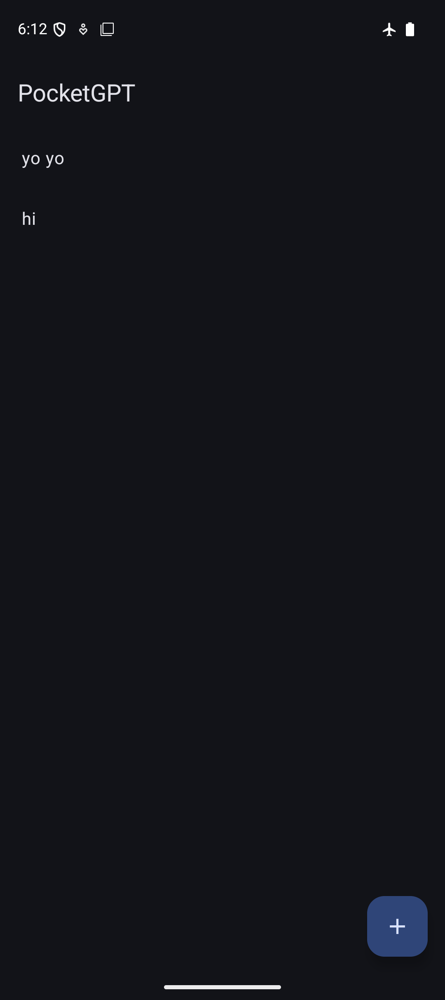
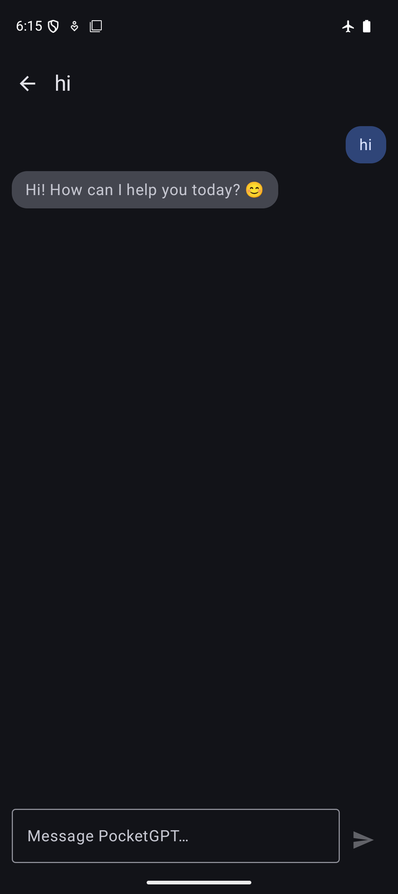

# PocketGPT

An Android chat app that runs a large language model **entirely on-device** — no server, no API key, and no network calls during a conversation. Powered by [LiteRT-LM](https://ai.google.dev/edge/litert) running Google's Gemma model locally. The one exception is a one-time model download on first launch (see below).




## Features

- **On-device inference** — Gemma runs locally via LiteRT-LM; conversations never leave the phone.
- **Streaming responses** — tokens render as they're generated.
- **Automatic model setup** — the ~2.4GB checkpoint downloads on first launch straight into app-private storage, no `adb push` required. A blocking "Setting up PocketGPT" dialog shows live progress so the UI never looks broken while it's fetching or loading.
- **Multi-chat history** — start any number of named conversations; titles are derived automatically from the first message.
- **Persistent storage** — chats are saved locally with Room and survive app restarts.
- **Multi-turn context** — the full conversation is replayed to the model on every turn, so it remembers earlier messages in the same chat.

## Tech stack

- **UI:** Jetpack Compose, Material 3, Navigation Compose
- **Architecture:** MVI with a domain/data/presentation split — a sealed `Intent` dispatched through one entry point, a single `StateFlow<UiState>`, one-time events delivered through a separate `Effect` channel rather than persisted state
- **DI:** Hilt
- **Persistence:** Room
- **Concurrency:** Kotlin Coroutines & Flow
- **Inference:** [LiteRT-LM](https://ai.google.dev/edge/litert) running Gemma

## Architecture

```
domain/         — models, repository interfaces, InferenceEngine/ModelDownloader contracts (no Android/framework deps)
data/
  inference/    — InferenceEngineImpl (LiteRT-LM), ModelDownloaderImpl (fetches the checkpoint), ModelManager (lifecycle owner)
  local/        — Room entities, DAOs, database
  repository/   — ChatRepositoryImpl: assembles history, persists messages, streams model replies
presentation/
  chat/         — chat screen, ViewModel, MVI Intent/State/Effect types, the model-setup dialog
  conversations/— conversation list screen + ViewModel
  navigation/   — NavHost wiring the two screens together
```

The repository is the single source of truth for chat history: the UI observes it via `Flow`, and the inference engine itself holds no state between calls — every turn is given the full conversation it needs to answer.

## Running it

The model (~2.4GB) isn't bundled in the APK. On first launch, the app downloads it automatically — no manual setup:

1. Build and run — `./gradlew installDebug`.
2. Open any chat. The first time, a "Setting up PocketGPT" dialog shows download progress, then loads the engine; this takes a few minutes depending on your connection. Every chat after that opens instantly, since the model stays loaded for the app's process lifetime.

The checkpoint is fetched from a public, ungated mirror on Hugging Face ([`litert-community/gemma-4-E2B-it-litert-lm`](https://huggingface.co/litert-community/gemma-4-E2B-it-litert-lm)) into the app's private storage — see `provideModelUrl()`/`provideModelPath()` in `di/InferenceModule.kt` to point at a different source.

Requires `minSdk 26` and the `INTERNET` permission (declared in the manifest, needed only for that first download). Inference runs on-device, so a physical device or an emulator with enough RAM is recommended for reasonable performance.
